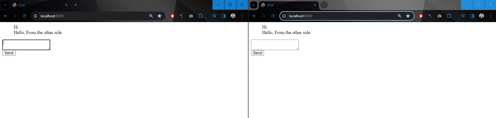

# Chat App Project
A simple chat application built in Go

## Run
To run the app run the following command in root directory.
```shell
./chat-app.exe
```

## Examples


## Extra
Project was based upon the following video.
https://www.youtube.com/watch?v=y036l6pvVEs&ab_channel=EsotericTech