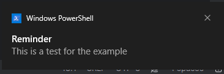
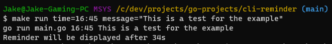
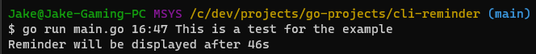
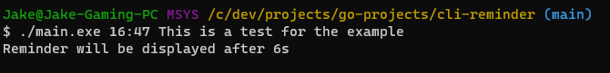

# Cli Reminder Project
A command line interface reminder project built in Go.

## Run
This application can be run a few ways.
```shell
make run time=<time reminder value> message=<reminder message>
```
```shell
./main.exe <time reminder value> <message>
```
```shell
go run main.go <time reminder value> <message>
```

## Examples




