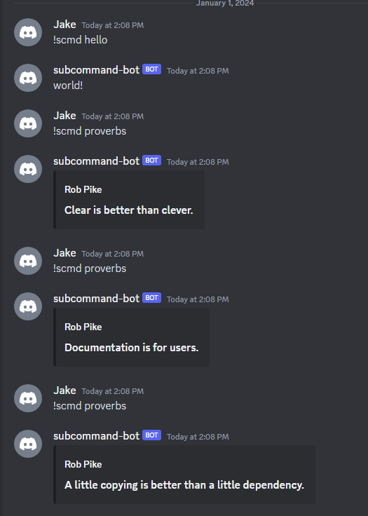

# Discord Subcommand Bot
A Discord bot that has different commands depending on the arguments passed after the bots prefix.

## Run App
### Local
To run the app you can either run the executable or build and run. (Or some combination depending on your workflow)
```shell
./main.exe
```
or
```shell
go build main.go && go run main.go
```
### Docker
To run the app you can also use the docker image with also passing in the environment variable.
```shell
docker run -e DISCORD_BOT_TOKEN=<TOKEN HERE> -d jdwillmsen/go-discord-subcommand-bot
```

### Docker Compose
To run the app you can also use the docker compose file.
```shell
docker compose up -d
```

## Environment Variables
This bot will require a `.env` file setup to run. Or the variables setup in the os environment variables.
```env
DISCORD_BOT_TOKEN=<TOKEN HERE>
```

## Docker
### Build
#### Docker Hub
To be able to build the image you can run the following command from this directory.
```shell
docker build . -t jdwillmsen/go-discord-subcommand-bot:latest
```
i.e. (With additional version tag)
```shell
docker build . -t jdwillmsen/go-discord-subcommand-bot:latest -t jdwillmsen/go-discord-subcommand-bot:1.0.0
```

#### GitHub Containers
To be able to build the image for GitHub containers you can run the following command.
```shell
docker build . -t ghcr.io/jdwillmsen/go-discord-subcommand-bot:latest
```
i.e. (With additional version tag)
```shell
docker build . -t ghcr.io/jdwillmsen/go-discord-subcommand-bot:latest -t ghcr.io/jdwillmsen/go-discord-subcommand-bot:1.0.0
```

### Tag
After the image is built you can add additional tags with the following command.
```shell
docker tag jdwillmsen/go-discord-subcommand-bot:latest jdwillmsen/go-discord-subcommand-bot:<tag>
```

### Push
#### Docker Hub
To be able to push the image you can run the following command. (-a for all tags)
```shell
docker push -a jdwillmsen/go-discord-subcommand-bot
```

#### GitHub Containers
To be able to push the image you can run the following command. (-a for all tags)
```shell
docker push -a ghcr.io/jdwillmsen/go-discord-subcommand-bot
```

## Examples
