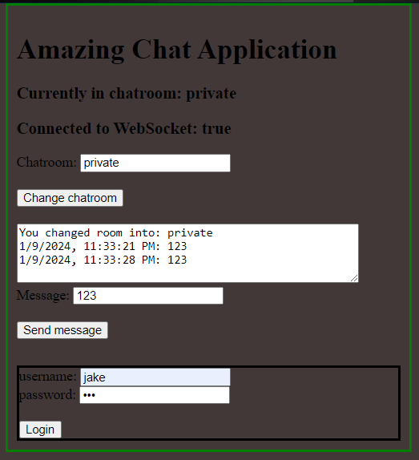

# Go Websockets
A go secure websocket implementation that has different chat rooms, websocket authentication 
with one time password, and ability to send messages. This application makes use of the wss protocol
to be able to transmit secure messages.

## Run
In order to run the application run the following command.
```shell
go run *.go
```
Link: https://localhost:8080

## Examples


## Certs
The servers certificate/keys were generated with openssl with the `gencert.bash` script.