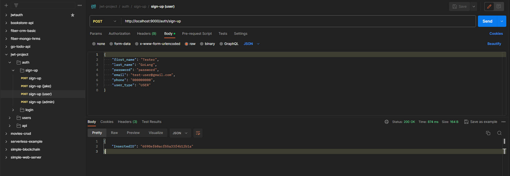
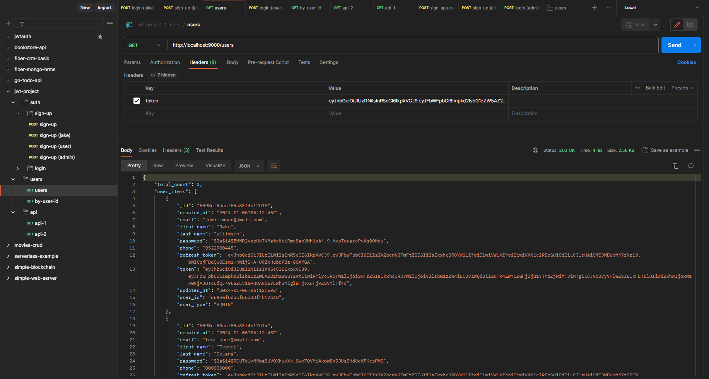
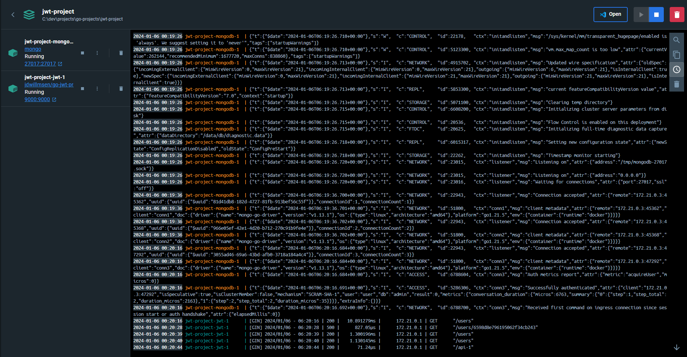

# JWT Project
A go jwt implementation project with storage in a mongo database. This project contains ways for users to sign up
and then login to retrieve a JWT token along with a refresh token. This project also contains a basic roles setup
with the structure for the user containing a type.

This project also makes use of a `Makefile` so that all commands are consolidated in one place. Hence, if you have make
installed you can run the commands below else you can always go to `Makefile` and run commands from there.

## Run App
### Local
To run the app you can either run the executable or build and run. (Or some combination depending on your workflow)
```shell
make run
```
### Docker
To run the app you can also use the docker image with also passing in the environment variable.
```shell
make docker-run
```

### Docker Compose
To run the app you can also use the docker compose file.
```shell
make docker-compose
```

## Environment Variables
This app will require a `.env` file setup to run. Or the variables setup in the os environment variables.
```env
PORT=<PORT HERE>
MONGODB_URL=<MONGODB URI HERE>
```

## Database
The database used in mongodb and can be run manually with the following command.
```shell
make mongodb
```

## API
There is an included postman collection that can be imported into Postman if desired. Also, can take a look at the routes
files and use curls or any other preferred tools. \
File: `jwt-project.postman_collection.json`

## Docker
### Build
#### Docker Hub
To be able to build the image you can run the following command from this directory.
```shell
make docker-build
```

#### GitHub Containers
To be able to build the image for GitHub containers you can run the following command.
```shell
make github-build
```

### Push
#### Docker Hub
To be able to push the image you can run the following command.
```shell
make docker-publish
```

#### GitHub Containers
To be able to push the image you can run the following command.
```shell
make github-publish
```

## Examples




## Project Details

Project started: January 2nd, 2024

### Developers

- Jake Willmsen