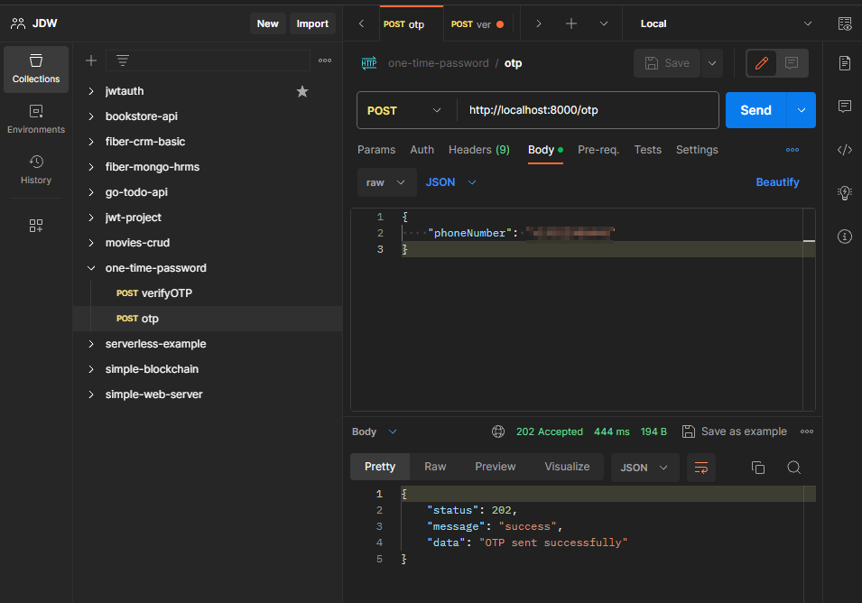
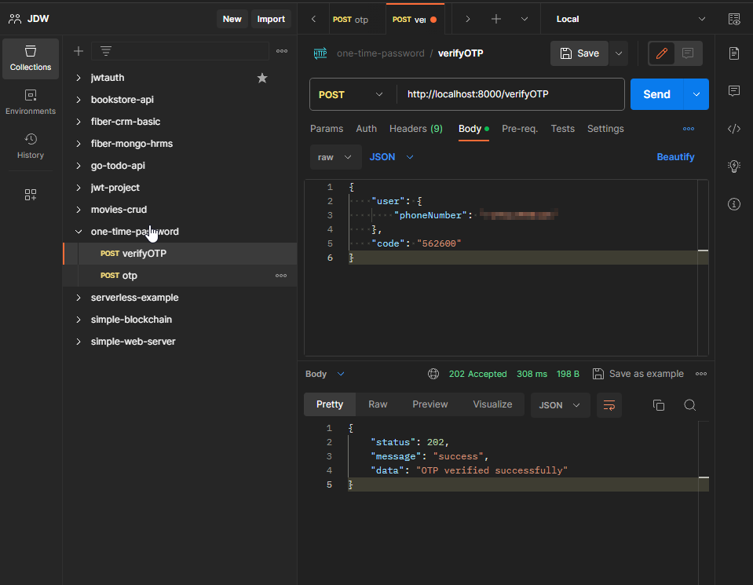

# One Time Password Project
A simple one time password project (OTP) written in Go.

## Examples



## Commands
```shell
curl --location 'http://localhost:8000/otp' \
--header 'Content-Type: application/json' \
--data '{
    "phoneNumber": "+phoneNumber"
}'
```

```shell
curl --location 'http://localhost:8000/verifyOTP' \
--header 'Content-Type: application/json' \
--data '{
    "user": {
        "phoneNumber": "+phoneNumber"
    },
    "code": "code from phoneNumber"
}'
```